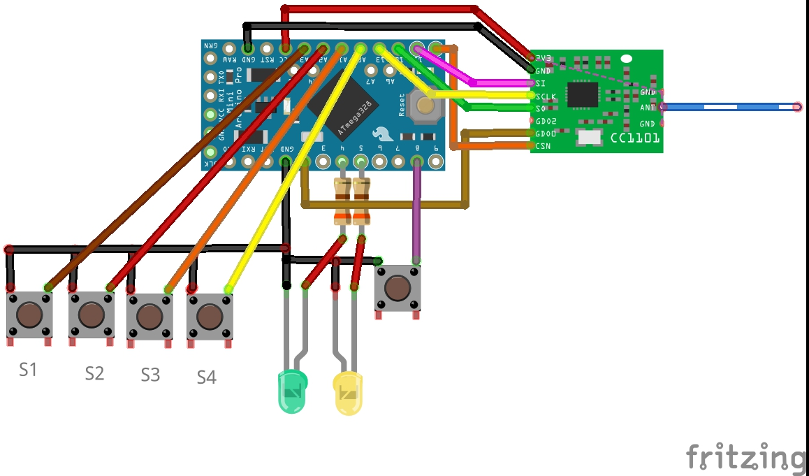

# HM-PBI-4-FM Funktaster-Schnittstelle 4-fach
# evt. auch HM-SCI-3-FM Funkschaler-Schnittstelle 3-fach
## benötigte Hardware
 * 1x Arduino Pro Mini **ATmega328P (3.3V/8MHz)**
 * 1x CC1101 Funkmodul **(868 MHz)**
 * 1x FTDI Adapter (wird nur zum Flashen benötigt)
* 1x Taster 6*6
* 1x Batteriehalter print für CR2032 **[Reichelt KZH 20P](https://www.reichelt.de/knopfzellenclip-fuer-20-mm-print-kzh-20p-p56575.html?&trstct=pos_0)** oder [EBAY](https://www.ebay.de/itm/CR2012-2032-Knopfzellenhalter-max-20-mm-Silber-Printmontage-horizontal-2/253806533551?hash=item3b180c5baf:g:IOUAAOSwtlZb0KwD:rk:2:pf:0)
* 1x Batterie CR2032
* 1x Platinensteckverbinder gerade, braun, 5-polig [**Reichelt PS 25/5G BR**](https://www.reichelt.de/platinensteckverbinder-gerade-braun-5-polig-ps-25-5g-br-p40400.html?)

Optional die LEDS und Widerstände 
**Verringert die Batterielaufzeit**
* 2x Widerstand 330 Ohm
* 2x LED 3mm

[Kontakt via Facebook](https://www.facebook.com/ronny.thomas.83)

[Software HM-PBI-4-FM Funktaster-Schnittstelle 4-fach ](https://github.com/jp112sdl/Beispiel_AskSinPP/blob/master/examples/HM-PBI-4-FM/HM-PBI-4-FM.ino) von Jérôme

[Software HM-SCI-3-FM Kontakt-Interface für Öffner und Schließerkontake ](https://github.com/jp112sdl/Beispiel_AskSinPP/blob/master/examples/HM-SCI-3-FM/HM-SCI-3-FM.ino) von Jérôme

Abmaße der Platine 52 x 29mm 

[Gehäuse](https://www.thingiverse.com/thing:3350531)

Kabelfarbe 	Belegung
Schwarz		GND
Gelb		S1
Orange		S2
Rot		S3
Braun		S4

Schalter / Taster weden gegen GND (Schwarz geschaltet)
	

HM-SCI-3-FM - Mit geänderter Software auf 4 Schaltkontakte

**Passt in eine tiefe Unterputzdose incl. Schalter:)**

HM-SCI-3-FM
Übertragungsmodus auf Standard stellt da im Sketch keine AES Verschlüsselung aktiviert ist!

[Bitte vergesst das BOD Flashen des Arduinos nicht!](https://asksinpp.de/Grundlagen/FAQ/babbling_idiot.html)

Da bei Batteriebetrieb mit 3V der Spannungsregler (LDO) nicht benötigt wird und auch die Power LED sowie die LED_BUILTIN nur unnötig Strom verbrauchen, können diese Bauteile (X) ganz unproblematisch entfernt werden.

